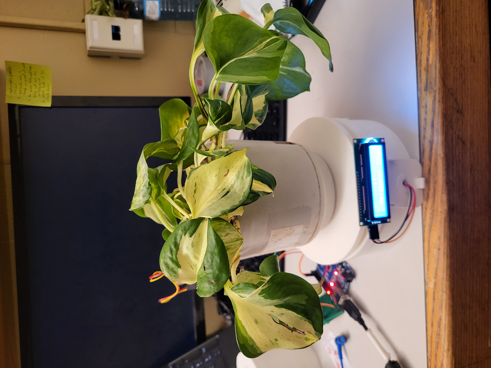
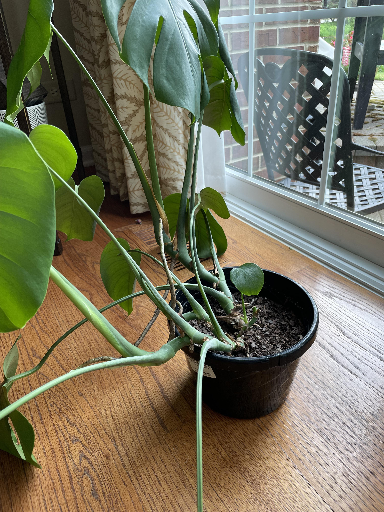
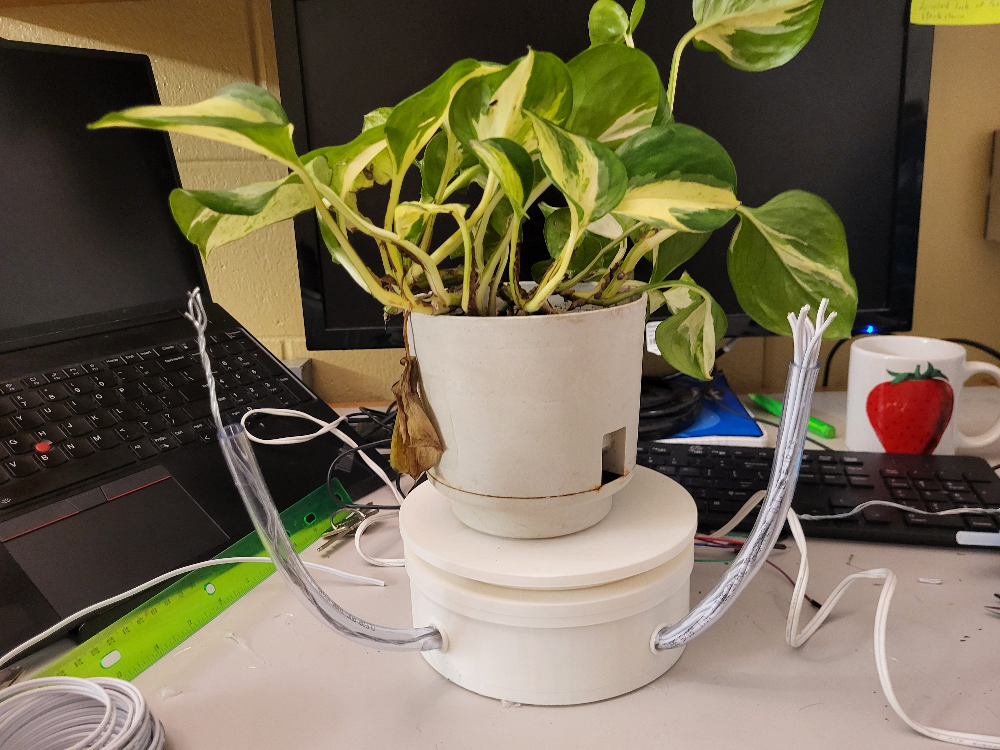
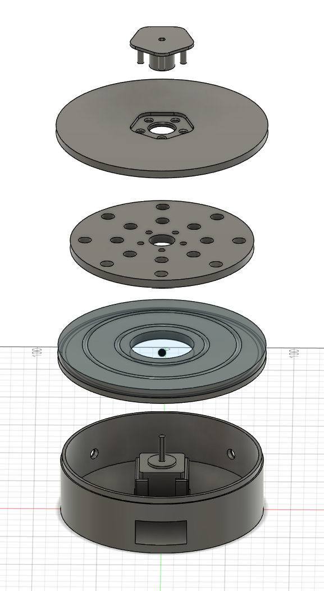
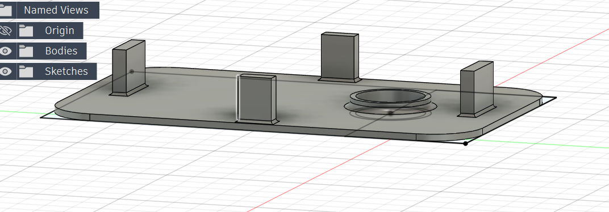
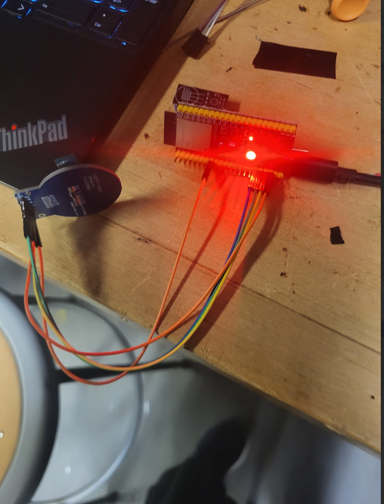
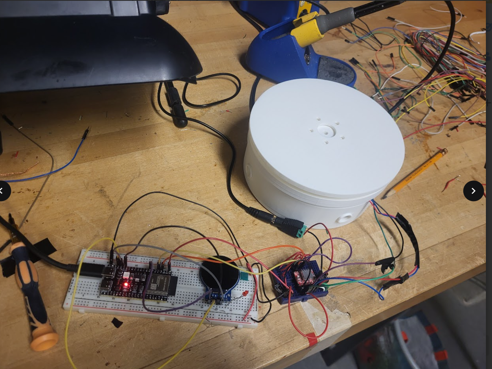
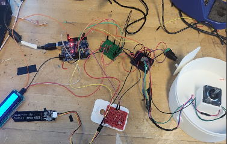

# The Plant Rotator
### Treating Plant Scoliosis by an even dose of prescribed sunlight.

## Project Description:
My final project is a rotating turn table that translates the plants needs into both emotional reactions and rotational movements to ensure even distribution of sunlight. 

The plant is rotated by a Nema14 stepper motor which is microstepped to 1/16 of a step to ensure smooth and slow movement to help reduce any turning friction. The platform turn table also has ball bearings which helps further reduce surface friction under the load of the plant pot. 

As a houseplant owner I often forget to rotate my plant causing all of the leaves to grow towards the window and the plant to become very lopsided in a form of plant-scoliosis. I solved this problem through iterating the platform in 1 sixth intervals for one rotation and 1 sixth intervals backwards to not tangle the soil moisture sensor attached to the plant pot.



For the demos, I reduced the one week intervals to 3 seconds per 1/6 of a turn. But I can add a if waiting condition that can count the amount of ticks asynchronously to satisfy a week long delay of an unsigned long representing 604800000UL. 

Video Preview:
https://drive.google.com/drive/folders/1nPxjAhwzCAb3B3d1R-t5u-tSsGQGVkJm 

The monitoring or emotional translation aspect comes in the form of soil moisture measurement which is correlated to a emoticon based on 5 levels evenly spaces from 0 to 100. Angry, sad, neutral or flat, happy, and laughing. This uses a analog capacitive moisture sensor.  


Video Preview: 
https://drive.google.com/file/d/1AssZAjXiQ8I0WT4PqLrcP601mBrOoc3o/view?usp=drive_link 

I thought this would be a cute idea to help personify what many including me originally would consider a decorative object. I chose soil moisture because it is an aspect directly connected to your care and creates a dependency relationship like feeding a pet. 

## Conceptual design to final prototype
I started with creating many sketches of a rotating cylinder turn table with tendrils extended for the screen and sensor components. I then learned how hard it was to guarantee continuity in normal jumper wires and having them through long tendrils only increases the chance of failure. I also felt that the movable tendrils were more of a gimmick than a useful tool to reorient light sensors.



And thus in my initial CAD of the one part I knew would not change in new iterations included two holes for those tendrils which I learned were also good mounting holes.


I also decided that I would not cad a full enclosure for the perfboards that would supposedly hold the sensors and screen until they were locked down. This worked well as it helped me accelerate the progress of the project while letting me design enclosures in retrospect. However with the final I2C screen I did not use an enclosure as the wiring was clean and minimal and the size was larger than I expected. 



What was good is that I realize how important time management was to the whole process of design, purchasing materials, and fabrication. Time was the constantly depleting resources whether it was ordering replacement parts or trying to get testing properly done without haphazardly jumping to soldering. 

I am very thankful for learning about asynchronous scheduling from my experience doing firmware onboarding. This helped me schedule the motor step delays without interfering with the screen updates. 


## Problems, problems, and design modifications.
This project was definitely eye opening on the patience and vigilance needed to make a working circuit. I was able to rack up a death count of 2 ESPs one falsely soldered backwards (with very spotty connections) and one shorted where the 3V3 pin no longer worked. This ended in me using the Arduino to continue with my ESP plans also removing my ability to use the GC9A01. I also fried my own light sensor because of exposed jumper wire. This project was definitely, first and foremost, a learning experience.


I had to compromise with the screen where originally I wanted to use Squarelite to design a custom UI. But the Arduino could not run the GC9A01, so it forced me to take my project and strip it down to the core values which was the personification of plants.


<!--  -->


Here is a midway photo:


It was very messy, not disorganized but messy. Like the shared ground and powers were killing the flow of progress. So I decided to simplify the sensors down to the actually interactable one which was the soil moisture sensor.

I had fun stringing together my proposal to real world design. A few times I had to stop and question what I really wanted out of the design which was to personify the plant and also help automate the thing I often forget to do. That thing was not watering but rotating the plant pot. 
 
## A project with many learning experiences
I definitely learned a lot about structuring project time. The most time was spent on the wiring and testing. Sourcing and buying parts was also a really significant and slightly annoying portion where I would realize I can't use a part or need a replacement and then would have to delay testing by a week or two. I think more concrete circuit diagrams such as perfboard layouts help reduce error as often error would happen when I tried to deviate from a perfboard plan.

I also learned that breaking the project down into independent components can be very helpful in building a mental model and confidence in your project. However, I also learned that hooking up all these independent components together is not as easy as it seems especially when you have to have multiple components sharing a voltage source. 

I am thankful that I have an emblem of my own doing to look at and remind me of SYDE 2A and SYDE 263. I am also quite satisfied with the result, the screen updates super fast because of the asynchronous calls.

## Final results and feedback for my future self!
Well now I have a nice miniature automated lazy susan! Of course it can be for plants but I learned in testing its really pretty to look at with the refraction of liquids. 

I will definitely start with a full perfboard/breadboard plan next time that way I confront the wiring problems early and holistically as I can actively see the number of pins being used.

I can try to revisit the project by buying a replacement ESP32 and carefully wiring to my original specifications. However, I think it will be better suited towards another project idea like maybe a wearable device. Because to be frank the plant is always going to be in one spot in the house which kind lowers the value proposition of having wireless technology.


# Bill of Materials
To create my project I used the following items. Each item is listed with a link to the source. If items were used that were not purchased then an equivalent item available for purchase is included. 

| Part Name / Description | Unit Price | Purchased | Used | Cost Contribution | Vendor / Source |
|-------------------------|-----------:|----------:|-----:|------------------:|-----------------|
| NEMA14 Stepper | 16.89 | 1 | 1 | 16.89 | Sayal *(receipt in sourcing lab)* |
| Arduino UNO | 34.00 | 1 | 1 | 34.00 | [Amazon – UNO R3](https://www.amazon.ca/2pcs-ATmega328P-ATMEGA16U2-Development-Compatible/dp/B01EWOE0UU) |
| Aluminum Electrolytic Capacitors | 3.48 | 1 | 1 | 3.48 | [AliExpress](https://www.aliexpress.com) |
| AC 240V → 12V DC 2A Universal Adapter | 5.82 | 1 | 1 | 5.82 | [AliExpress](https://www.aliexpress.com) |
| 12V DC Power Connector Plug Jack Terminal | 5.10 | 5 | 1 | 1.02 | [AliExpress](https://www.aliexpress.com) |
| A4988 Stepper Motor Driver | 4.81 | 1 | 1 | 4.81 | [AliExpress](https://www.aliexpress.com) |
| Laser Cut Plywood – Quarter Sheet | 1.50 | 1 | 1 | 1.50 | Rapid Prototyping Centre |
| Jumper Wire Kit | 13.08 | 1 | 1 | 13.08 | [AliExpress](https://www.aliexpress.com) |
| Mini Breadboards (6‑pack) | 12.00 | 5 | 5 | 12.00 | [Amazon – ELEGOO 170‑pt Breadboards](https://www.amazon.ca/ELEGOO-170-Points-Breadboard-Arduino/dp/B01EV6LJ7G) |
| Gikfun Capacitive Soil Moisture Sensor (2‑pack) | 14.63 | 2 | 1 | 7.32 | [Amazon – EK1940](https://www.amazon.ca/Gikfun-Capacitive-Corrosion-Resistant-Arduino/dp/B07QCP2451) |
| 1.28" GC9A01 Round TFT LCD (5‑pack) | 37.28 | 5 | 1 | 7.46 | [Amazon – GC9A01](https://www.amazon.ca/D-FLIFE-Display-Interface-Arduino-240x240/dp/B09C1ZQG4H) |
| Ball Bearings (10 mm, 20‑pack) | 11.19 | 1 | 1 | 11.19 | [Amazon – uxcell G10](https://www.amazon.ca/uxcell-Precision-Bearing-Keychain-Scientific/dp/B07QKQ6G2M) |
| Freenove I2C Display | 17.95 | 1 | 1 | 17.95 | [Amazon – Freenove I2C Display](https://www.amazon.ca/Freenove-Display-Compatible-Arduino-Raspberry/dp/B0B76Z83Y4) |

Total Project Cost (Including Bundle Waste): CAD$ 160.84
Total Project Cost of Components Used: CAD$ 136.51

##  Final code:
``` 
#include <AccelStepper.h>
#include <LiquidCrystal_I2C.h>
#include <Wire.h>

#define STEP_PIN 3
#define DIR_PIN 2

const int MICROSTEP_DIVIDER = 16;
const int STEPS_PER_REV = 200 * MICROSTEP_DIVIDER;
const int SIXTH = STEPS_PER_REV / 6;

AccelStepper stepper(AccelStepper::DRIVER, STEP_PIN, DIR_PIN);
LiquidCrystal_I2C lcd(0x27, 16, 2);

// Screen switching 
unsigned long lastScreenSwitch = 0;
const unsigned long screenInterval = 3000;  // 3 seconds
bool showFaceScreen = true;

// LCD refresh 
unsigned long lastLCD = 0;
const unsigned long lcdInterval = 250;

// Stepper state
int targetIndex = 0;
int direction = 1;

// Emotion function
String getFace(int moisture) {
  if (moisture >= 80) return "XD";     // laughing
  if (moisture >= 60) return ":)";     // smiley
  if (moisture >= 40) return ":|";     // flat
  if (moisture >= 20) return ":(";     // sad
  return "> :(";                       // angry
}

void setup() {
  Wire.begin();
  Wire.setClock(100000);

  lcd.init();
  lcd.backlight();
  lcd.clear();

  stepper.setMaxSpeed(200);
  stepper.setAcceleration(100);
  stepper.setCurrentPosition(0);
  stepper.moveTo(0);
}

void loop() {
  unsigned long now = millis();

  // Switch screens every few seconds
  if (now - lastScreenSwitch >= screenInterval) {
    lastScreenSwitch = now;
    showFaceScreen = !showFaceScreen;
    lcd.clear();
  }

  // LCD update
  if (now - lastLCD >= lcdInterval) {
    lastLCD = now;

    int raw = analogRead(A1);
    int moisture = map(raw, 900, 300, 0, 100);
    moisture = constrain(moisture, 0, 100);

    if (showFaceScreen) {
      // FACE SCREEN
      lcd.setCursor(7, 0);
      lcd.print(getFace(moisture));

      lcd.setCursor(2, 1);
      lcd.print("Moisture: ");
      lcd.print(moisture);
      lcd.print("%   ");

    } else {
      // DATA SCREEN
      lcd.setCursor(0, 0);
      lcd.print("Soil Moisture:");

      lcd.setCursor(0, 1);
      lcd.print("Moist: ");
      lcd.print(moisture);
      lcd.print("%   ");
    }
  }

  // Non-blocking stepper motion
  if (stepper.distanceToGo() == 0) {
    targetIndex += direction;

    if (targetIndex > 6) {
      targetIndex = 5;
      direction = -1;
    }
    if (targetIndex < 0) {
      targetIndex = 1;
      direction = 1;
    }

    stepper.moveTo(targetIndex * SIXTH);
  }

  stepper.run();
}

```